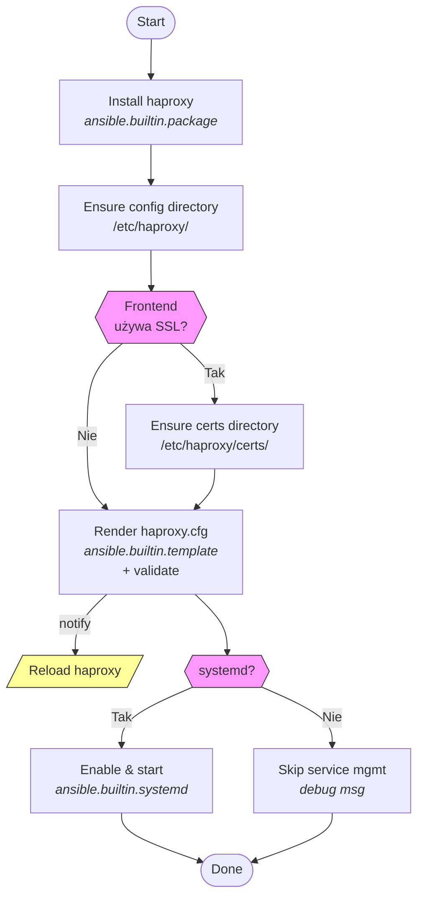
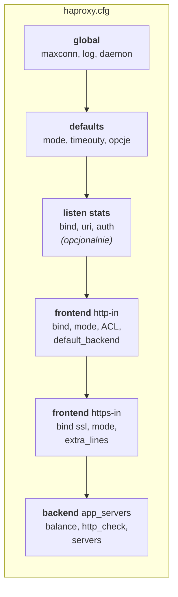
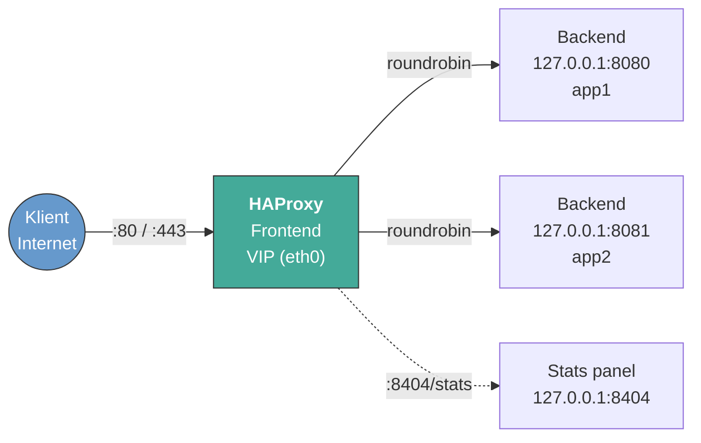

#  haproxy

Ansible Role instalująca i konfigurująca **HAProxy** jako load balancer HTTP/HTTPS.

---

## Wspierane platformy

- Ubuntu / Debian
- RedHat / CentOS / AlmaLinux / Rocky
- Alpine Linux

---

## Zmienne

Cała konfiguracja przekazywana jest przez słownik `in_haproxy`. Poniżej kluczowe sekcje:

| Sekcja | Opis |
|---|---|
| `global` | Tuning globalny: `maxconn`, `log`, `extra_lines` |
| `defaults` | Domyślne timeouty, tryb, opcje |
| `stats` | Panel statystyk (domyślnie `127.0.0.1:8404/stats`) |
| `frontends` | Lista frontendów — `name`, `bind`, `mode`, `default_backend`, `acls`, `use_backends`, `options`, `extra_lines` |
| `backends` | Lista backendów — `name`, `mode`, `balance`, `options`, `http_check`, `tcp_check`, `servers`, `extra_lines` |

Każdy serwer w backendzie: `name`, `address`, `port`, `params` (np. `"check"`).

---

## Przykład użycia

Typowy scenariusz — usługi z localhost wystawione na VIP (eth0):

```yaml
- hosts: haproxy_nodes
  roles:
    - role: haproxy
      vars:
        in_haproxy:
          frontends:
            - name: http-in
              bind: "{{ ansible_facts['default_ipv4']['address'] }}:80"
              mode: http
              default_backend: app_servers

            - name: https-in
              bind: "{{ ansible_facts['default_ipv4']['address'] }}:443 ssl crt /etc/haproxy/certs/site.pem"
              mode: http
              default_backend: app_servers
              extra_lines:
                - "http-request set-header X-Forwarded-Proto https"

          backends:
            - name: app_servers
              mode: http
              balance: roundrobin
              http_check:
                send: "meth GET uri /health"
                expect: "status 200"
              servers:
                - name: app1
                  address: 127.0.0.1
                  port: 8080
                  params: "check"
```

Pełny przykład: [examples/localhost-to-vip.yml](examples/localhost-to-vip.yml)

## Architektura roli

### Flow wykonania tasków



### Struktura generowanej konfiguracji



### Schemat sieciowy (typowy use-case)



---

## Contributions

Jeśli masz pomysły na ulepszenia, zgłoś problemy, rozwidl repozytorium lub utwórz Merge Request. Wszystkie wkłady są mile widziane!
[Contributions](CONTRIBUTING.md)

---

## License

[Licencja](LICENSE) oparta na zasadach Creative Commons BY-NC-SA 4.0, dostosowana do potrzeb projektu.

---

## Author Information

|  |
|---------------------------------------------------------------------------------------------------|
| [Maciej Rachuna](https://gitlab.commrachuna)                                                      |
